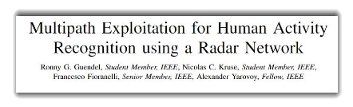

**README** 

**Dataset & code:	<https://doi.org/10.4121/e1d6a078-9022-4f48-9aa6-e22389980fee>**   

Citable code: 	<https://zenodo.org/doi/10.5281/zenodo.10594434>   

GitHub code: 	<https://github.com/rgundel/public_multipath_data_read> 

Dataset: Continuous Human Activities Utilizing Three Pulsed Radars Exploiting Multipath

Responsible Author:		Ronny Gerhard Guendel

Email:            			r.guendel@icloud.com

Created:          			30-01-2024

Modified:         			31-01-2024

**Table of Contents**

[Referencing the dataset	1](#_toc157621149)

[Background reading for the dataset and its collection:	2](#_toc157621150)

[Background reading for the used radar system:	2](#_toc157621151)

[Matlab read file	3](#_toc157621152)

[Radar setup	3](#_toc157621153)

[Statistics of the participants	5](#_toc157621154)

[Data description and information:	5](#_toc157621155)

[Folder description	5](#_toc157621156)

[File Index description and data examples	5](#_toc157621157)

[Description and notification table	7](#_toc157621158)

[Corresponding classes	11](#_toc157621159)

## **Referencing the dataset**
Guendel, R.G., Fioranelli, F., Yarovoy, A.. *‘Dataset: Continuous Human Activities Utilizing Three Pulsed Radars Exploiting Multipath’*. (4TU.ResearchData, 2024 [Online]. doi: https://doi.org/10.4121/e1d6a078-9022-4f48-9aa6-e22389980fee.

@misc{Guendel:Dataset:multipath, 

author={Guendel, Ronny Gerhard and Fioranelli, Francesco and Yarovoy, Alexander}, 

title={Dataset: Continuous Human Activities Utilizing Three Pulsed Radars Exploiting Multipath}, 

DOI={10.4121/e1d6a078-9022-4f48-9aa6-e22389980fee},  

publisher={4TU.ResearchData}, 

year = {2024}, 

month={Feb} }
## **Background reading for the dataset and its collection:** 
**Multipath Exploitation for Human Activity Recognition using a Radar Network**

R. G. Guendel, N.C. Kruse, F. Fioranelli, A. Yarovoy: *Multipath Exploitation for Human Activity*

*Recognition using a Radar Network*. in IEEE Transactions on Geoscience and Remote Sensing.

## **Background reading for the used radar system:** 
**Distributed radar fusion and recurrent networks for classification of continuous human activities**

Guendel, R.G., Fioranelli, F.,Yarovoy, A.: *Distributed radar fusion and recurrent networks for classification of continuous human activities*. IET Radar Sonar Navig. 1–18 (2022). <https://doi.org/10.1049/rsn2.12249> 

[Link:](https://doi.org/10.1049/rsn2.12249) <https://doi.org/10.1049/rsn2.12249> 

**Continuous human activity recognition for arbitrary directions with distributed radars**

R. G. Guendel, M. Unterhorst, E. Gambi, F. Fioranelli and A. Yarovoy, "*Continuous human activity recognition for arbitrary directions with distributed radars,*" *2021 IEEE Radar Conference (RadarConf21)*, 2021, pp. 1-6, doi: 10.1109/RadarConf2147009.2021.9454972.

[Link:](https://ieeexplore.ieee.org/document/9454972) <https://ieeexplore.ieee.org/document/9454972> 

## **Matlab read file**
Reading the range time data files: 	main\_1\_rt\_processing\_ex.m 

Reading the micro Doppler data files: 	main\_2\_mD\_spectrogram\_processing\_ex.m

Reading the range Doppler data files: 	main\_3\_rD\_processing\_ex.m
## **Radar setup** 

*Figure 1: (left) A sketch of the room layout shows three radars, with two of them, R1 and R2, capable of benefiting from multipaths. R3 is positioned on the reflection wall and provides the range for calculating the target location 𝑥̃ using trilateration. (right) Geometrical relationships are illustrated to show the multipath ranges, denoted as 𝑟₁, 𝑟'₁, and 𝑟₂* 

*Figure 2: Experimental setup showing the radar nodes circled in red and the reflector in the green rectangle.*

Figure 1 illustrates the geometric relationship between the radar system and the reflection wall. The radar system, depicted in Figures 2 and 3, is the PulsON P410 - Time Domain (Humatics), operating as an Ultra Wideband radar. The Humatics P410 (formerly PulsON) possesses key operational parameters: a center frequency (f\_c) of 4.3 GHz, bandwidth (B) of 2.2 GHz, and a range resolution (r\_res) of 68 mm, calculated using the formula r\_res = c / (2 \* B).

In terms of temporal characteristics, it features a slow-time Pulse Repetition Frequency (PRF) of 122 Hz, Pulse Repetition Interval (PRI) of 8.2 ms, and the ability to discern unambiguous Doppler frequencies (f\_max ±61 Hz) and velocities (v\_max ±2.2 m/s).

Additionally, it has a nominal pulse interval (t\_pulse) of approximately 100 ns, a nominal pulse width (τ\_pulse) of around 2 ns, and a sampling resolution (T\_s) specified at 61 ps. These parameters collectively define the radar's operational performance and are vital for its various applications.

Center frequency:   		4.3 GHz

Bandwidth:   			2.2GHz

Oeration mode: 		Monostatic

Pulse integration Index: 	10 (1024 coherent integrations)

PRI/PRF: 			8.2ms / 122Hz

Antennae: 			Omnidirectional broadband antennas

*Figure 3: The PulsON P410 - Time Domain (Humatics) radar.*

## **Statistics of the participants**

|**Participant**|**Year of birth**|**Age**|**Height**|**Weight**|**Gender**|
| :-: | :-: | :-: | :-: | :-: | :-: |
|1|1986|36|183|81|M|
|2|1991|31|162|70|F|
|3|1994|28|168|75|M|
|4|1985|37|170|73|M|
|5|1996|26|170|48|F|
|6|1998|24|166|52|F|
|7|1998|24|155|52|F|
|8|1999|23|158|73|F|
|9|1997|25|169|58|F|
|10|1993|29|167|77|M|
|11|2000|22|192|90|M|
|12|1999|23|180|90|M|
|13|1998|24|175|48|M|
|14|1994|28|173|60|F|
|std|4\.737|4\.737|9\.788|14\.663||
|mean|1994\.857|27\.143|170\.571|67\.643|7:7 = 50%:50%|

## **Data description and information:** 
### **Folder description**
The dataset consists of 45 folders, dedicated to 14 participants and containing the data of, range-time data, micro Doppler spectrogram data, and range Doppler data. Within this dataset, a total of 12 distinct classes have been defined to categorize various activities and behaviors. These classes include *'Junk/BRN,' 'Walking,' 'Stationary,' 'Sitting down,' 'Standing up (Sit),' 'Bending (Sit),' 'Bending (Sta),' 'Falling (Wlk),' 'Standing up (Fal),' 'Falling (Sta),' 'Micro Gesture,'* and *'Walking (Obj)’*. Each class represents a specific type of movement or action performed by the participants during the three repetitions of 60 seconds of data recording.
### **File Index description and data examples**
Explanation: 

Index number 01 … 14 associated to each of the 14 participants

Index number 0 is a background noise measurement of the room without a participant in the scene 

*Figure 5: 1\_range\_time\_maps\_labeled.zip … is the range time data of participant 1*

*Figure 6: 1\_microDoppler\_spectrograms\_labeled.zip … is the micro Doppler data of participant 1*

*Figure 4: 1\_rangeDoppler\_maps\_labeled.zip … is the range Doppler data of participant 1*
### **Description and notification table**

|**Participant**|**File**|**Sub file**|
| :-: | :-: | :-: |
|0 (Backgr. noise)|'0\_microDoppler\_spectrograms\_labeled.zip'|'0\_1\_microDoppler\_spectrograms\_labeled.mat'|
|0 (Backgr. noise)|'0\_rangeDoppler\_maps\_labeled.zip'|'0\_1\_rangeDoppler\_maps\_labeled.mat'|
|0 (Backgr. noise)|0\_range\_time\_maps\_labeled.zip'|'0\_1\_range\_time\_maps\_labeled.mat'|
|0 (Backgr. noise)|'0\_microDoppler\_spectrograms\_labeled.zip'|'0\_2\_microDoppler\_spectrograms\_labeled.mat'|
|0 (Backgr. noise)|'0\_rangeDoppler\_maps\_labeled.zip'|'0\_2\_rangeDoppler\_maps\_labeled.mat'|
|0 (Backgr. noise)|0\_range\_time\_maps\_labeled.zip'|'0\_2\_range\_time\_maps\_labeled.mat'|
|1|'1\_microDoppler\_spectrograms\_labeled.zip'|'1\_1\_microDoppler\_spectrograms\_labeled.mat'|
|1|'1\_rangeDoppler\_maps\_labeled.zip'|'1\_1\_rangeDoppler\_maps\_labeled.mat'|
|1|'1\_range\_time\_maps\_labeled.zip'|'1\_1\_range\_time\_maps\_labeled.mat'|
|1|'1\_microDoppler\_spectrograms\_labeled.zip'|'1\_2\_microDoppler\_spectrograms\_labeled.mat'|
|1|'1\_rangeDoppler\_maps\_labeled.zip'|'1\_2\_rangeDoppler\_maps\_labeled.mat'|
|1|'1\_range\_time\_maps\_labeled.zip'|'1\_2\_range\_time\_maps\_labeled.mat'|
|1|'1\_microDoppler\_spectrograms\_labeled.zip'|'1\_3\_microDoppler\_spectrograms\_labeled.mat'|
|1|'1\_rangeDoppler\_maps\_labeled.zip'|'1\_3\_rangeDoppler\_maps\_labeled.mat'|
|1|'1\_range\_time\_maps\_labeled.zip'|'1\_3\_range\_time\_maps\_labeled.mat'|
|2|'2\_microDoppler\_spectrograms\_labeled.zip'|'2\_1\_microDoppler\_spectrograms\_labeled.mat'|
|2|'2\_rangeDoppler\_maps\_labeled.zip'|'2\_1\_rangeDoppler\_maps\_labeled.mat'|
|2|'2\_range\_time\_maps\_labeled.zip'|'2\_1\_range\_time\_maps\_labeled.mat'|
|2|'2\_microDoppler\_spectrograms\_labeled.zip'|'2\_2\_microDoppler\_spectrograms\_labeled.mat'|
|2|'2\_rangeDoppler\_maps\_labeled.zip'|'2\_2\_rangeDoppler\_maps\_labeled.mat'|
|2|'2\_range\_time\_maps\_labeled.zip'|'2\_2\_range\_time\_maps\_labeled.mat'|
|2|'2\_microDoppler\_spectrograms\_labeled.zip'|'2\_3\_microDoppler\_spectrograms\_labeled.mat'|
|2|'2\_rangeDoppler\_maps\_labeled.zip'|'2\_3\_rangeDoppler\_maps\_labeled.mat'|
|2|'2\_range\_time\_maps\_labeled.zip'|'2\_3\_range\_time\_maps\_labeled.mat'|
|3|'3\_microDoppler\_spectrograms\_labeled.zip'|'3\_1\_microDoppler\_spectrograms\_labeled.mat'|
|3|'3\_rangeDoppler\_maps\_labeled.zip'|'3\_1\_rangeDoppler\_maps\_labeled.mat'|
|3|'3\_range\_time\_maps\_labeled.zip'|'3\_1\_range\_time\_maps\_labeled.mat'|
|3|'3\_microDoppler\_spectrograms\_labeled.zip'|'3\_2\_microDoppler\_spectrograms\_labeled.mat'|
|3|'3\_rangeDoppler\_maps\_labeled.zip'|'3\_2\_rangeDoppler\_maps\_labeled.mat'|
|3|'3\_range\_time\_maps\_labeled.zip'|'3\_2\_range\_time\_maps\_labeled.mat'|
|3|'3\_microDoppler\_spectrograms\_labeled.zip'|'3\_3\_microDoppler\_spectrograms\_labeled.mat'|
|3|'3\_rangeDoppler\_maps\_labeled.zip'|'3\_3\_rangeDoppler\_maps\_labeled.mat'|
|3|'3\_range\_time\_maps\_labeled.zip'|'3\_3\_range\_time\_maps\_labeled.mat'|
|4|'4\_microDoppler\_spectrograms\_labeled.zip'|'4\_1\_microDoppler\_spectrograms\_labeled.mat'|
|4|'4\_rangeDoppler\_maps\_labeled.zip'|'4\_1\_rangeDoppler\_maps\_labeled.mat'|
|4|'4\_range\_time\_maps\_labeled.zip'|'4\_1\_range\_time\_maps\_labeled.mat'|
|4|'4\_microDoppler\_spectrograms\_labeled.zip'|'4\_2\_microDoppler\_spectrograms\_labeled.mat'|
|4|'4\_rangeDoppler\_maps\_labeled.zip'|'4\_2\_rangeDoppler\_maps\_labeled.mat'|
|4|'4\_range\_time\_maps\_labeled.zip'|'4\_2\_range\_time\_maps\_labeled.mat'|
|4|'4\_microDoppler\_spectrograms\_labeled.zip'|'4\_3\_microDoppler\_spectrograms\_labeled.mat'|
|4|'4\_rangeDoppler\_maps\_labeled.zip'|'4\_3\_rangeDoppler\_maps\_labeled.mat'|
|4|'4\_range\_time\_maps\_labeled.zip'|'4\_3\_range\_time\_maps\_labeled.mat'|
|5|'5\_microDoppler\_spectrograms\_labeled.zip'|'5\_1\_microDoppler\_spectrograms\_labeled.mat'|
|5|'5\_rangeDoppler\_maps\_labeled.zip'|'5\_1\_rangeDoppler\_maps\_labeled.mat'|
|5|'5\_range\_time\_maps\_labeled.zip'|'5\_1\_range\_time\_maps\_labeled.mat'|
|5|'5\_microDoppler\_spectrograms\_labeled.zip'|'5\_2\_microDoppler\_spectrograms\_labeled.mat'|
|5|'5\_rangeDoppler\_maps\_labeled.zip'|'5\_2\_rangeDoppler\_maps\_labeled.mat'|
|5|'5\_range\_time\_maps\_labeled.zip'|'5\_2\_range\_time\_maps\_labeled.mat'|
|5|'5\_microDoppler\_spectrograms\_labeled.zip'|'5\_3\_microDoppler\_spectrograms\_labeled.mat'|
|5|'5\_rangeDoppler\_maps\_labeled.zip'|'5\_3\_rangeDoppler\_maps\_labeled.mat'|
|5|'5\_range\_time\_maps\_labeled.zip'|'5\_3\_range\_time\_maps\_labeled.mat'|
|6|'6\_microDoppler\_spectrograms\_labeled.zip'|'6\_1\_microDoppler\_spectrograms\_labeled.mat'|
|6|'6\_rangeDoppler\_maps\_labeled.zip'|'6\_1\_rangeDoppler\_maps\_labeled.mat'|
|6|'6\_range\_time\_maps\_labeled.zip'|'6\_1\_range\_time\_maps\_labeled.mat'|
|6|'6\_microDoppler\_spectrograms\_labeled.zip'|'6\_2\_microDoppler\_spectrograms\_labeled.mat'|
|6|'6\_rangeDoppler\_maps\_labeled.zip'|'6\_2\_rangeDoppler\_maps\_labeled.mat'|
|6|'6\_range\_time\_maps\_labeled.zip'|'6\_2\_range\_time\_maps\_labeled.mat'|
|6|'6\_microDoppler\_spectrograms\_labeled.zip'|'6\_3\_microDoppler\_spectrograms\_labeled.mat'|
|6|'6\_rangeDoppler\_maps\_labeled.zip'|'6\_3\_rangeDoppler\_maps\_labeled.mat'|
|6|'6\_range\_time\_maps\_labeled.zip'|'6\_3\_range\_time\_maps\_labeled.mat'|
|7|'7\_microDoppler\_spectrograms\_labeled.zip'|'7\_1\_microDoppler\_spectrograms\_labeled.mat'|
|7|'7\_rangeDoppler\_maps\_labeled.zip'|'7\_1\_rangeDoppler\_maps\_labeled.mat'|
|7|'7\_range\_time\_maps\_labeled.zip'|'7\_1\_range\_time\_maps\_labeled.mat'|
|7|'7\_microDoppler\_spectrograms\_labeled.zip'|'7\_2\_microDoppler\_spectrograms\_labeled.mat'|
|7|'7\_rangeDoppler\_maps\_labeled.zip'|'7\_2\_rangeDoppler\_maps\_labeled.mat'|
|7|'7\_range\_time\_maps\_labeled.zip'|'7\_2\_range\_time\_maps\_labeled.mat'|
|7|'7\_microDoppler\_spectrograms\_labeled.zip'|'7\_3\_microDoppler\_spectrograms\_labeled.mat'|
|7|'7\_rangeDoppler\_maps\_labeled.zip'|'7\_3\_rangeDoppler\_maps\_labeled.mat'|
|7|'7\_range\_time\_maps\_labeled.zip'|'7\_3\_range\_time\_maps\_labeled.mat'|
|8|'8\_microDoppler\_spectrograms\_labeled.zip'|'8\_1\_microDoppler\_spectrograms\_labeled.mat'|
|8|'8\_rangeDoppler\_maps\_labeled.zip'|'8\_1\_rangeDoppler\_maps\_labeled.mat'|
|8|'8\_range\_time\_maps\_labeled.zip'|'8\_1\_range\_time\_maps\_labeled.mat'|
|8|'8\_microDoppler\_spectrograms\_labeled.zip'|'8\_2\_microDoppler\_spectrograms\_labeled.mat'|
|8|'8\_rangeDoppler\_maps\_labeled.zip'|'8\_2\_rangeDoppler\_maps\_labeled.mat'|
|8|'8\_range\_time\_maps\_labeled.zip'|'8\_2\_range\_time\_maps\_labeled.mat'|
|8|'8\_microDoppler\_spectrograms\_labeled.zip'|'8\_3\_microDoppler\_spectrograms\_labeled.mat'|
|8|'8\_rangeDoppler\_maps\_labeled.zip'|'8\_3\_rangeDoppler\_maps\_labeled.mat'|
|8|'8\_range\_time\_maps\_labeled.zip'|'8\_3\_range\_time\_maps\_labeled.mat'|
|9|'9\_microDoppler\_spectrograms\_labeled.zip'|'9\_1\_microDoppler\_spectrograms\_labeled.mat'|
|9|'9\_rangeDoppler\_maps\_labeled.zip'|'9\_1\_rangeDoppler\_maps\_labeled.mat'|
|9|'9\_range\_time\_maps\_labeled.zip'|'9\_1\_range\_time\_maps\_labeled.mat'|
|9|'9\_microDoppler\_spectrograms\_labeled.zip'|'9\_2\_microDoppler\_spectrograms\_labeled.mat'|
|9|'9\_rangeDoppler\_maps\_labeled.zip'|'9\_2\_rangeDoppler\_maps\_labeled.mat'|
|9|'9\_range\_time\_maps\_labeled.zip'|'9\_2\_range\_time\_maps\_labeled.mat'|
|9|'9\_microDoppler\_spectrograms\_labeled.zip'|'9\_3\_microDoppler\_spectrograms\_labeled.mat'|
|9|'9\_rangeDoppler\_maps\_labeled.zip'|'9\_3\_rangeDoppler\_maps\_labeled.mat'|
|9|'9\_range\_time\_maps\_labeled.zip'|'9\_3\_range\_time\_maps\_labeled.mat'|
|10|'10\_microDoppler\_spectrograms\_labeled.zip'|'10\_1\_microDoppler\_spectrograms\_labeled.mat'|
|10|'10\_rangeDoppler\_maps\_labeled.zip'|'10\_1\_rangeDoppler\_maps\_labeled.mat'|
|10|'10\_range\_time\_maps\_labeled.zip'|'10\_1\_range\_time\_maps\_labeled.mat'|
|10|'10\_microDoppler\_spectrograms\_labeled.zip'|'10\_2\_microDoppler\_spectrograms\_labeled.mat'|
|10|'10\_rangeDoppler\_maps\_labeled.zip'|'10\_2\_rangeDoppler\_maps\_labeled.mat'|
|10|'10\_range\_time\_maps\_labeled.zip'|'10\_2\_range\_time\_maps\_labeled.mat'|
|10|'10\_microDoppler\_spectrograms\_labeled.zip'|'10\_3\_microDoppler\_spectrograms\_labeled.mat'|
|10|'10\_rangeDoppler\_maps\_labeled.zip'|'10\_3\_rangeDoppler\_maps\_labeled.mat'|
|10|'10\_range\_time\_maps\_labeled.zip'|'10\_3\_range\_time\_maps\_labeled.mat'|
|11|'11\_microDoppler\_spectrograms\_labeled.zip'|'11\_1\_microDoppler\_spectrograms\_labeled.mat'|
|11|'11\_rangeDoppler\_maps\_labeled.zip'|'11\_1\_rangeDoppler\_maps\_labeled.mat'|
|11|'11\_range\_time\_maps\_labeled.zip'|'11\_1\_range\_time\_maps\_labeled.mat'|
|11|'11\_microDoppler\_spectrograms\_labeled.zip'|'11\_2\_microDoppler\_spectrograms\_labeled.mat'|
|11|'11\_rangeDoppler\_maps\_labeled.zip'|'11\_2\_rangeDoppler\_maps\_labeled.mat'|
|11|'11\_range\_time\_maps\_labeled.zip'|'11\_2\_range\_time\_maps\_labeled.mat'|
|11|'11\_microDoppler\_spectrograms\_labeled.zip'|'11\_3\_microDoppler\_spectrograms\_labeled.mat'|
|11|'11\_rangeDoppler\_maps\_labeled.zip'|'11\_3\_rangeDoppler\_maps\_labeled.mat'|
|11|'11\_range\_time\_maps\_labeled.zip'|'11\_3\_range\_time\_maps\_labeled.mat'|
|12|'12\_microDoppler\_spectrograms\_labeled.zip'|'12\_1\_microDoppler\_spectrograms\_labeled.mat'|
|12|'12\_rangeDoppler\_maps\_labeled.zip'|'12\_1\_rangeDoppler\_maps\_labeled.mat'|
|12|'12\_range\_time\_maps\_labeled.zip'|'12\_1\_range\_time\_maps\_labeled.mat'|
|12|'12\_microDoppler\_spectrograms\_labeled.zip'|'12\_2\_microDoppler\_spectrograms\_labeled.mat'|
|12|'12\_rangeDoppler\_maps\_labeled.zip'|'12\_2\_rangeDoppler\_maps\_labeled.mat'|
|12|'12\_range\_time\_maps\_labeled.zip'|'12\_2\_range\_time\_maps\_labeled.mat'|
|12|'12\_microDoppler\_spectrograms\_labeled.zip'|'12\_3\_microDoppler\_spectrograms\_labeled.mat'|
|12|'12\_rangeDoppler\_maps\_labeled.zip'|'12\_3\_rangeDoppler\_maps\_labeled.mat'|
|12|'12\_range\_time\_maps\_labeled.zip'|'12\_3\_range\_time\_maps\_labeled.mat'|
|13|'13\_microDoppler\_spectrograms\_labeled.zip'|'13\_1\_microDoppler\_spectrograms\_labeled.mat'|
|13|'13\_rangeDoppler\_maps\_labeled.zip'|'13\_1\_rangeDoppler\_maps\_labeled.mat'|
|13|'13\_range\_time\_maps\_labeled.zip'|'13\_1\_range\_time\_maps\_labeled.mat'|
|13|'13\_microDoppler\_spectrograms\_labeled.zip'|'13\_2\_microDoppler\_spectrograms\_labeled.mat'|
|13|'13\_rangeDoppler\_maps\_labeled.zip'|'13\_2\_rangeDoppler\_maps\_labeled.mat'|
|13|'13\_range\_time\_maps\_labeled.zip'|'13\_2\_range\_time\_maps\_labeled.mat'|
|13|'13\_microDoppler\_spectrograms\_labeled.zip'|'13\_3\_microDoppler\_spectrograms\_labeled.mat'|
|13|'13\_rangeDoppler\_maps\_labeled.zip'|'13\_3\_rangeDoppler\_maps\_labeled.mat'|
|13|'13\_range\_time\_maps\_labeled.zip'|'13\_3\_range\_time\_maps\_labeled.mat'|
|14|'14\_microDoppler\_spectrograms\_labeled.zip'|'14\_1\_microDoppler\_spectrograms\_labeled.mat'|
|14|'14\_rangeDoppler\_maps\_labeled.zip'|'14\_1\_rangeDoppler\_maps\_labeled.mat'|
|14|'14\_range\_time\_maps\_labeled.zip'|'14\_1\_range\_time\_maps\_labeled.mat'|
|14|'14\_microDoppler\_spectrograms\_labeled.zip'|'14\_2\_microDoppler\_spectrograms\_labeled.mat'|
|14|'14\_rangeDoppler\_maps\_labeled.zip'|'14\_2\_rangeDoppler\_maps\_labeled.mat'|
|14|'14\_range\_time\_maps\_labeled.zip'|'14\_2\_range\_time\_maps\_labeled.mat'|
|14|'14\_microDoppler\_spectrograms\_labeled.zip'|'14\_3\_microDoppler\_spectrograms\_labeled.mat'|
|14|'14\_rangeDoppler\_maps\_labeled.zip'|'14\_3\_rangeDoppler\_maps\_labeled.mat'|
|14|'14\_range\_time\_maps\_labeled.zip'|'14\_3\_range\_time\_maps\_labeled.mat'|
###

## **Corresponding classes**
All classes in the label vector are associated as:

|**Labels**|**Label Names**|
| :- | :- |
|0|'Junk/BRN'|
|1|'Walking'|
|2|'Stationary'|
|3|'Sitting down'|
|4|'Standing up (Sit)'|
|5|'Bending (Sit)'|
|6|'Bending (Sta)'|
|7|'Falling (Wlk)'|
|8|'Standing up (Fal)'|
|9|'Falling (Sta)'|
|10|'micro Gesture'|
|11|'Walking (Obj)'|

